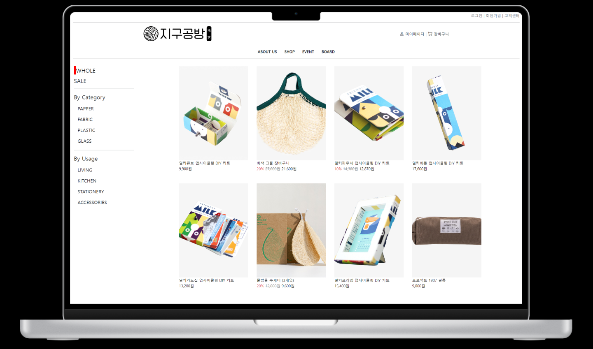

# 지구공방

# 사이트
[사이트](http://g-workshop-pnecz.run.goorm.io/home)

# 프로젝트 소개

이 프로젝트는 KH정보교육원 개발팀의 파이널 프로젝트인 새활용 쇼핑몰 사이트인 지구공방을 구축한 것입니다. 이 쇼핑몰은 새활용 쇼핑몰인 만큼 그 재료와 용도에 맞춰 고객이 원하는 상품을 쉽고 빠르게 찾을 수 있도록 UI/UX를 구성하였습니다.

쇼핑몰의 관리자는 상품, 게시글 등을 추가, 수정, 삭제하거나 주문 및 배송 현황을 관리하는 관리자 페이지를 제공합니다.

# 기술 스택
언어 : Java, HTML, JavaScript  
기술 : JSP, EL, JSTL, jQuery, Ajax  
프레임워크 : SpringBoot, SpringSecurity, Bootstrap  
데이터베이스 : MySQL, MyBatis  
개발도구 : Visual Studio Code

# 기능 요약
상품 검색 및 필터링  
상품 상세 페이지  
장바구니 추가 및 삭제  
주문하기  
관리자 페이지  
로그인/아웃  
회원가입  
마이페이지  

# 개발 기간
2023년 02월 02일 ~ 2023년 03월 09일

# 팀원 소개(3명)
### 하성수(팀장)  

### 김현정  

### 진보경  
회원가입 로그인/아웃, Admin 로그인/아웃, 마이페이지 (주문내역 / 반품교환취소/ 리뷰작성 / 1:1문의 / 회원정보수정/탈퇴)  
Admin 페이지 회원목록, 주문내역 / 주문상세내역, 배송 내역, 운송장등록, 답변이 필요한 1:1 문의내역 출력 (답변작성)

# 시연영상
[영상](https://youtu.be/ugQ0E2SM54w)

# ERD
[ERD](./database/ERD.png)

# 프로젝트 수행 후 느낀점
처음에는 많은 기능들을 만들고 싶었으나 시간이 부족해 다 만들지 못한 것이 아쉬웠습니다. 그리고 한 사이트의 ERD 설계하는 것이 매우 어렵다는 것을 깨달았습니다. 기능을 만드는 것보다 설계에 더 많은 시간이 들었습니다. 그럼에도 불구하고 기능을 만들다 보니 부족한 점이 있어 수정을 해야했습니다. DB에 관련해서 공부를 더 해야겠다고 생각했습니다. 프로그램을 만들 때 서로 질문하며 팀원들과의 적극적인 소통도 중요함을 느꼈습니다. 파이널 프로젝트를 통해 학원에서 배운 내용들을 점검하고 사용해볼 수 있었으며 프로젝트 수행 이전보다 사이트의 구조에 대해 더 잘 알게 되었습니다. 
